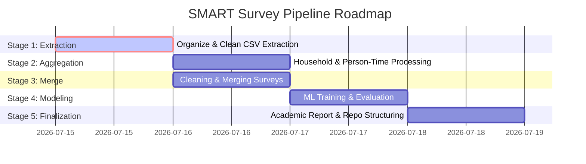

# SMART Survey Processing Pipeline & Mortality Prediction Plan

Provide a detailed technical roadmap to process raw SMART Survey `.as` files, build a structured data pipeline, train machine learning models for mortality prediction, and compile the final academic report.

## Executive Summary

SMART (Standardized Monitoring and Assessment of Relief and Transitions) surveys are the global gold standard for assessing nutrition, mortality, and food security in emergencies. Programmatically processing the raw `.as` files (the native text format of ENA for SMART software) is a key data engineering task.

This document presents a comprehensive project analysis and implementation plan. By reviewing the raw files and the previous code, we have identified **critical bugs in the existing processing logic** (specifically, the loss of the first data record in aggregate surveys and the dirty format of extracted CSVs) and **new analytical insights** (such as the variation in recall periods across surveys from 90 to 125 days). Resolving these issues is necessary before beginning household aggregation, feature engineering, and training the machine learning models.

---

## Project Structure Analysis

The project workspace is organized as follows:

*   **Workspace Root**: `c:\Users\hp\OneDrive\Documents\A A Data\`
    *   [organize_surveys.py](file:///c:/Users/hp/OneDrive/Documents/A%20A%20Data/organize_surveys.py): Python script from the previous assignment containing initial file handling, deduplication, and classification logic.
    *   `Final project Data Science.pdf`: Project requirement sheet.
    *   `Data_Science_Machine_Learning_Algorithms.pdf`: Course reference on machine learning models.
    *   `Smart Survey Data Sets.rar`: Compressed archive containing the raw surveys.
*   **Survey Data Directory**: `c:\Users\hp\OneDrive\Documents\A smart survey\Smart Survey Data Sets\`
    *   `Smart Survey Data Sets/`: Contains 100 raw `.as` files.
    *   `raw data/`: Duplicate raw files and a `csv/` subfolder.
    *   `output/`: Processed surveys categorized into:
        *   `admin2_surveys/aggregate_surveys/`
        *   `admin2_surveys/individual_surveys/`
        *   `admin2_surveys/issue_surveys/`
        *   `lhz_surveys/individual_surveys/`

---

## Dataset Analysis

An inspection of the raw dataset reveals the following:

1.  **File Inventory**:
    *   Total files: 100
    *   Deduplicated files: 20 files are identical copies (marked with `- Copy` in their names).
    *   Unique files: 80 files.
2.  **Survey Classifications**:
    *   **Individual Surveys (65 total)**: Detail individual household member rosters (age, sex, and status indicators like left, joined, born, died).
        *   *Admin2 Surveys*: 53 unique files.
        *   *LHZ (Livelihood Zone) Surveys*: 12 unique files.
    *   **Aggregate Surveys (14 total)**: Standard household-level summaries of population counts, births, and deaths.
        *   *Admin2 Surveys*: 7 unique files.
        *   *LHZ (Livelihood Zone) Surveys*: 7 unique files.
    *   **Issue Surveys (1 total)**:
        *   `som_202206_admin2_dhuusamarreeb_idp.as`: Contains a header for individual mortality but no data rows (empty roster).
3.  **Metadata Naming Conventions**:
    *   Filenames include years (ranging from 2013 to 2023), locations, administrative levels, and survey type indicators.
    *   Year distribution: 2013 (10), 2014 (12), 2018 (32), 2020 (20), 2022 (21), 2023 (2).
4.  **Internal File Layout**:
    *   Plain-text tab-delimited records.
    *   Divided into sections with `?` prefixes (e.g., `?Planning:`, `?Training_new:`, `?Mortality_new:`, `?Mor_individual:`).
    *   Anthropometry (nutrition) data is at the top of the file.
    *   Mortality data is located at the bottom under the `?Mortality_new:` block (for aggregate surveys) or `?Mor_individual:` block (for individual surveys).
5.  **Dynamic Recall Period**:
    *   **Critical Discovery**: The recall period (used for person-time denominators) is not a constant 90 days. It is stored 10 lines below the `?Planning:` block in each `.as` file.
    *   Actual recall periods in the dataset vary: **90, 93, 96, 98, 101, 102, 104, 109, and 125 days**. Applying a static 90-day assumption would result in inaccurate mortality rate estimations.

---

## Existing Code Review

A review of the functions in [organize_surveys.py](file:///c:/Users/hp/OneDrive/Documents/A%20A%20Data/organize_surveys.py) highlights several limitations:

### 1. `ensure_dirs` / `clear_generated_outputs`
*   **Purpose**: Directory lifecycle management.
*   **Strengths**: Ensures folders exist and unlinks old run files.
*   **Weaknesses**: Absolute path references are hardcoded, limiting portability.

### 2. `normalized_name` / `infer_place` / `standardized_name`
*   **Purpose**: String manipulation to extract location names and standardize file nomenclature.
*   **Potential Bug**: `infer_place` contains `int(month)` on line 84. If `month` is parsed as a non-numeric string (e.g., `"Jan"`), it will raise a `ValueError` and crash the execution.
*   **Weakness**: The stopword list is hardcoded and may miss structural words in new files.

### 3. `parse_month_year` / `parse_month_year_from_date` / `get_month_year_from_survdate_column`
*   **Purpose**: Extracts temporal metadata from file contents or headers.
*   **Weakness**: Reads and joins the entire file content into a single string for date regex searching, which is memory-inefficient.

### 4. `has_aggregate_data` / `has_individual_data`
*   **Purpose**: Classifies files by checking for specific headers and numeric values.
*   **Strengths**: Effectively distinguishes between individual rosters and aggregate tables.

### 5. `write_raw_csv` / `row_to_csv`
*   **Purpose**: Formats content into comma-separated text.
*   **Weakness**: `write_raw_csv` naively replaces tabs with commas (`.replace("\t", ",")`). If any text cell contains a comma, the CSV structure will break.

### 6. `build_output_lines` (The Core Engine)
*   **CRITICAL BUG (Aggregate Surveys)**:
    ```python
    if in_aggregate_block:
        if not aggregate_header_seen:
            aggregate_header_seen = True
            out.append(row_to_csv(["month", "year"] + cells))
        else:
            out.append(row_to_csv([default_month, default_year] + cells))
    ```
    Because the aggregate block (`?Mortality_new:`) lacks a header row in raw `.as` files, the script treats the first row of actual data as the header. This results in:
    1.  The loss of the first household record.
    2.  Columns being named after the first record's data values (e.g., column names like `22`, `22`, `1`, `1`, `0`, `0`, `0`, `2`, `0`, `0`, `0`).
*   **Dirty CSV Output**: Instead of writing a clean CSV of only the mortality data, it writes out the entire `.as` file with commas. This results in mixed tables (Anthro, Planning, and Mortality) in the same file, which prevents standard CSV loading via `pandas`.

---

## Gap Analysis

| Requirement | Already Complete | Needs Modification | Missing | Details / Action Plan |
| :--- | :---: | :---: | :---: | :--- |
| **Read `.as` files** | Yes | | | Implemented in `main()`. |
| **Deduplicate surveys** | Yes | | | Stem matching and SHA256 checks are working. |
| **Survey Classification** | Yes | | | Categorizes individual, aggregate, and issue files. |
| **Standardize filenames** | Yes | | | File names generated match `SOM_yyyy_mm_place_level_fmt.csv`. |
| **Extract Dates** | Yes | | | Extracts from files/filenames, but needs a `ValueError` guard. |
| **Create Folder Structure** | Yes | | | Directory structure created, but needs path decoupling. |
| **Extract Mortality CSV** | | Yes | | **Required Change**: Output must contain only the mortality table. We must fix the aggregate header bug and map standard columns. |
| **Dynamic Recall Period** | | | Yes | **Required Change**: Extract the unique recall period for each file from the planning block. |
| **Household Processing** | | | Yes | **Required Change**: Aggregate individual rosters to household-level counts. |
| **Person-Time Calculation** | | | Yes | **Required Change**: Compute household and Under-5 person-time using the parsed recall period. |
| **District/Date Cleaning** | | | Yes | **Required Change**: Standardize location labels and clean dates in a cleaning script. |
| **Dataset Merge** | | | Yes | **Required Change**: Merge all processed household-level surveys into a single analysis CSV. |
| **Machine Learning** | | | Yes | **Required Change**: Train Logistic Regression, Random Forest, XGBoost, Naive Bayes, and KNN models. |
| **Model Evaluation** | | | Yes | **Required Change**: Compute Accuracy, Recall, F1, AUC, and Confusion Matrices. |
| **Project Report** | | | Yes | **Required Change**: Write a structured report with APA 7th citations. |

---

## Technical Risks & Mitigations

### 1. The Aggregate Column Header Bug
*   **Risk**: If we do not define standard headers for aggregate surveys, the merged dataset will have misaligned columns and corrupt values.
*   **Mitigation**: We will map the 11 columns in the aggregate block to: `HH`, `Cluster`, `Team`, `Total`, `Births`, `Deaths`, `Joined`, `Left`, `Total_U5`, `Births_U5`, `Deaths_U5`.

### 2. Mixed Tables in CSV Files
*   **Risk**: Currently, the output CSVs contain planning, anthro, and training blocks. Loading this into Python for aggregation will fail.
*   **Mitigation**: Re-write the CSV extraction to output ONLY the mortality table (rows and columns) to the CSV files.

### 3. Dynamic Recall Periods
*   **Risk**: Assuming a static 90-day recall period will cause person-time denominators to be incorrect, leading to errors in mortality rate calculations.
*   **Mitigation**: Parse the recall period from the `?Planning:` block of each file and carry it forward in the pipeline.

### 4. Target Variable Leakage / Definition in ML
*   **Risk**: Predicting mortality requires a clear target variable. Since the final analysis dataset is aggregated to the household level (one row per household), individual-level prediction is not possible on the merged dataset.
*   **Mitigation**: We will formulate the machine learning task to predict **household-level mortality** (binary classification: whether at least one death occurred in the household during the recall period, `1` if `Deaths > 0` else `0`).

---

## Proposed Changes

### [Survey Extraction Pipeline]

#### [MODIFY] [organize_surveys.py](file:///c:/Users/hp/OneDrive/Documents/A%20A%20Data/organize_surveys.py)
*   **Portability**: Refactor absolute paths to use `Path(__file__).parent` or configurable environment paths.
*   **Header Bug Fix**: Rewrite `build_output_lines` so that:
    *   For aggregate surveys, a standard header is written first, followed by all data rows (no data loss).
    *   For individual surveys, the output contains only the cleaned individual mortality table.
*   **Clean CSV Isolation**: Ensure the generated files in `output/` contain only the mortality tables, removing all other blocks (Planning, Anthro, options).
*   **Recall Period Extraction**: Implement a function to find `?Planning:` and extract the recall period from the line 10 rows below it. Save this value into the CSV metadata or prepend it as a column.

### [Data Engineering & Modeling]

#### [NEW] `process_households.py`
*   Reads the clean CSVs from the output folder.
*   For individual surveys: Aggregates the P1-P20 individual rows to the household level.
    *   `Total` = count of members where `died != 'y'` and `left != 'y'`.
    *   `Births` = count of members where `born == 'y'`.
    *   `Deaths` = count of members where `died == 'y'`.
    *   `Joined` = count of members where `join == 'y'`.
    *   `Left` = count of members where `left == 'y'`.
    *   `Total_U5` = count of members where `died != 'y'` and `left != 'y'` and `age < 5`.
    *   `Births_U5` = count of members where `born == 'y'` and `age < 5`.
    *   `Deaths_U5` = count of members where `died == 'y'` and `age < 5`.
*   For aggregate surveys: Reads the household-level counts directly.
*   **Person-Time Calculation**:
    *   $\text{Person-Time (Household)} = \text{Recall Period} \times [\text{Total} + 0.5 \times (\text{Deaths} + \text{Left} - \text{Births} - \text{Joined})]$
    *   $\text{Person-Time (Under-5)} = \text{Recall Period} \times [\text{Total\_U5} + 0.5 \times (\text{Deaths\_U5} + \text{Left\_U5} - \text{Births\_U5} - \text{Joined\_U5})]$
*   Outputs a household-level CSV for each survey.

#### [NEW] `clean_and_merge.py`
*   Merges all household-level CSVs into a single dataframe.
*   Cleans and standardizes the district names (`place` column).
*   Standardizes date formats and survey identifiers.
*   Saves the final clean master dataset to `final_mortality_analysis.csv`.

#### [NEW] `train_ml.py`
*   Loads `final_mortality_analysis.csv`.
*   Defines features (e.g., household size, joined members, left members, proportion of under-5s, location, season/month).
*   Defines target variable: `death_occurred` (`1` if `Deaths > 0` else `0`).
*   Splits data into train and test sets (stratified by target).
*   Trains **Logistic Regression**, **Random Forest**, **XGBoost**, **Naive Bayes**, and **KNN** models.
*   Calculates Accuracy, Recall, F1-Score, AUC, and Confusion Matrices.
*   Generates evaluation plots (ROC Curves, Confusion Matrix heatmaps, Feature Importance).

---

## Milestone Roadmap



### Milestone 1: Survey Organization & Clean CSV Extraction
*   **Goal**: Fix path issues, fix the aggregate header bug, isolate mortality CSVs, and extract recall periods.
*   **Complexity**: Medium.
*   **Files Affected**: `organize_surveys.py`, all files in `output/`.
*   **Git Commit Message**: `refactor: fix aggregate header bug and isolate mortality CSVs`

### Milestone 2: Household Processing & Person-Time
*   **Goal**: Aggregate individual survey rosters to household summaries and calculate person-time.
*   **Complexity**: Medium-High.
*   **Files Affected**: `process_households.py` (New).
*   **Git Commit Message**: `feat: implement household aggregation and person-time calculations`

### Milestone 3: Cleaning & Survey Merging
*   **Goal**: Clean district/place names and merge all survey data into `final_mortality_analysis.csv`.
*   **Complexity**: Medium.
*   **Files Affected**: `clean_and_merge.py` (New).
*   **Git Commit Message**: `feat: clean place names and merge all survey datasets`

### Milestone 4: Machine Learning Pipeline
*   **Goal**: Feature engineering, train Logistic Regression, Random Forest, XGBoost, Naive Bayes, and KNN models.
*   **Complexity**: High.
*   **Files Affected**: `train_ml.py` (New).
*   **Git Commit Message**: `feat: implement machine learning models for mortality prediction`

### Milestone 5: Model Evaluation
*   **Goal**: Compute comparison tables and generate confusion matrices and ROC curves.
*   **Complexity**: Medium.
*   **Files Affected**: `train_ml.py` (New), evaluation plot images.
*   **Git Commit Message**: `feat: generate model evaluation metrics and performance plots`

### Milestone 6: Final Academic Report
*   **Goal**: Write the university-compliant report PDF and organize the GitHub repository.
*   **Complexity**: Medium.
*   **Files Affected**: `Final_Project_Report.pdf`, `README.md`.
*   **Git Commit Message**: `docs: add final project report and repository readme`

---

## Verification Plan

### Automated Tests
*   Run the extraction script and assert that:
    *   No rows of data are lost for aggregate files.
    *   The output CSV files can be successfully loaded with `pd.read_csv`.
    *   Columns in the merged dataset have zero missing header values.
*   Assert that individual survey household aggregations match the sum of their parts.
*   Verify that person-time is positive and proportional to the parsed recall periods.

### Manual Verification
*   Spot-check 3 individual and 3 aggregate surveys: manually calculate person-days and compare them against the script outputs.
*   Check shape of final merged CSV to confirm it contains exactly 80 surveys' worth of household records.
